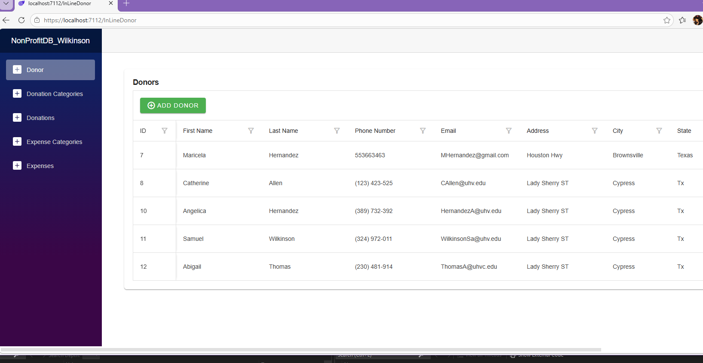

# Donor Management Web Application

Data driven web application that manages donor information, donations, and categorizing the donations

##Features:
-Add, edit, and delete donor information and donations
-Checks for duplicate values or names for donors and donations
-Manage donations records and categories
-Cascading deletion of donations when a donor is removed
-Dynamic data updates through a web-based interface
-Responsive and user-friendly UI
-Pop up notifications of different colors that will tell you if an addition of donor, donation, or donation categories was successful

##Functionality:
This functionality is implemented wiht a relational database to maintain consistency and data integrity
The application suports full CRUD operations:
-Create: Add new donors and donations
-Read: View donor adn donation data
-Update: Edit existing records through the UI
-Delete: Remove donors and automatically delete associated donations

##Technologies/Tools used:
-C#
-Blazor
-HTML/CSS
-SQL Server Management Studio (SSMS)

#Database Design:
The appliation uses a relational database with tables for:
-Donors (personal information)
-Donations (amounts and records)
-Donation Categories (donation types)

The database is designed and created using SSMS and reverse-engineered into Visual Studios for development

##What I learned:
-Integrating a SQL database with a web application
-Working with relational data and database design
-Displaying dynamic data in a web interface using Blazor
-Improving data presentation and usability in the UI

##Added Expense and Expense category later on in development and added script.sql file to view the SSMS data tables

##Screenshots:

